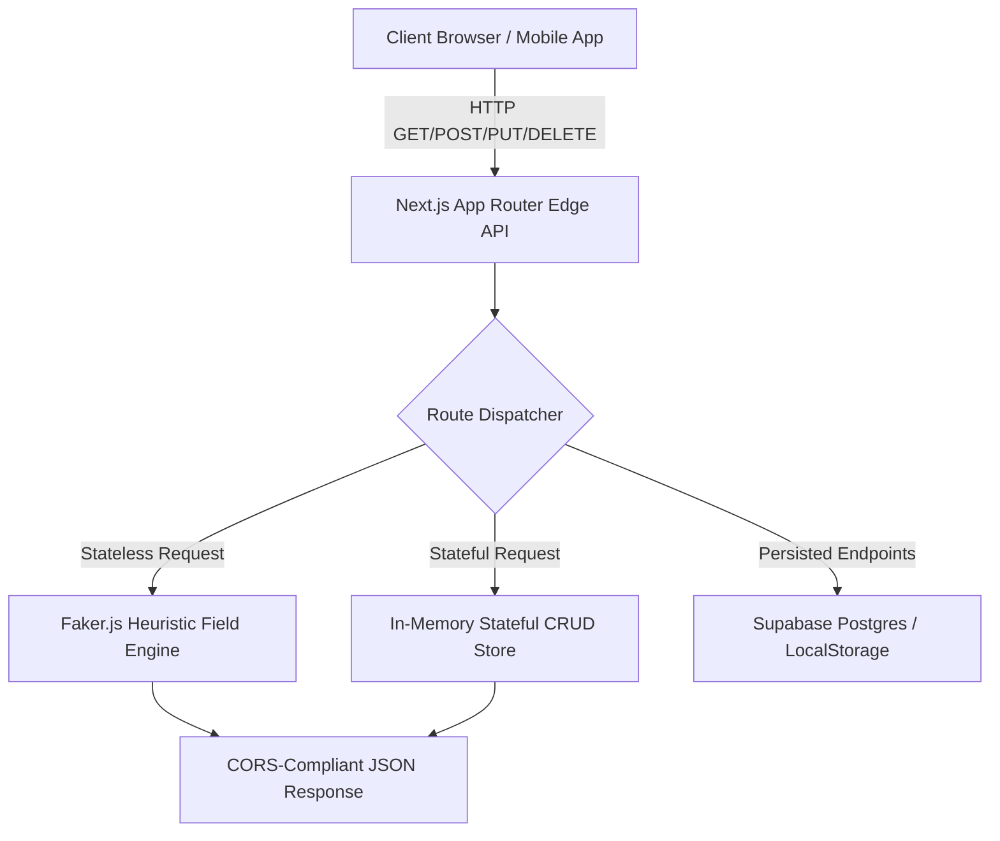

<div align="center">

  <h1>mockbit</h1>
  <p><strong>Instant, Local-First Mock API Generator for Modern Engineering Teams</strong></p>

  <p>
    <a href="https://github.com"></a>
    <a href="https://nextjs.org"></a>
    <a href="https://www.typescriptlang.org/"></a>
    <a href="https://supabase.com"></a>
    <a href="https://vercel.com"></a>
  </p>

  <p>
    <em>Zero Configuration • Zero Cost • Offline-First Engine • Stateful REST Simulation • OpenAPI 3.0 Export</em>
  </p>

</div>

---

## What is Mockbit?

**Mockbit** is an open-source, ultra-fast mock API service designed for frontend developers, mobile engineers, QA teams. 

Instead of waiting for backend services to be built or configuring heavy mock servers, Mockbit allows you to generate hosted & local REST endpoints in **under 5 seconds** — with dynamic Faker.js field generation, stateful CRUD persistence, custom latency delays, and one-click OpenAPI/Postman exports.

---

## ✨ Key Features

| Feature | Description |
| :--- | :--- |
| **💻 Terminal CLI (`npx mockbit`)** | Spin up an instant local mock HTTP server right from your terminal without opening a browser (`npx mockbit users.json`). |
| **🏎️ Zero-Latency Edge Engine** | Generates realistic mock responses in under 20ms using localized Faker.js field inferrers. |
| **🔄 Stateful REST Simulation** | Full REST lifecycle simulation: `POST` creates resources, `PUT`/`PATCH` updates, and `DELETE` mutates data in-memory. |
| **🔀 Request-Aware Rules** | Define conditional rules (`IF header/query/body match THEN return 401/409/422`) to test auth & error states. |
| **📄 Schema Inferrer & OpenAPI Export** | Paste raw JSON or OpenAPI specs to auto-build fields. Export schemas to `swagger.json` or Postman Collections with one click. |
| **⏱️ Latency & Failure Controls** | Test edge cases with custom HTTP status codes, artificial network latency (0ms – 5000ms), and probabilistic error injection. |
| **💻 Interactive Hero Playground** | Test mock API generation live directly on the homepage without creating an account or logging in. |
| **🐳 Docker & Offline-First Support** | Run completely offline in local dev environments using `docker-compose up`. |

---

## 🏗️ System Architecture



---

## 🚀 Quickstart Guide

### Option 1: Standalone Local Terminal CLI (`npx mockbit`)

Run an instant local mock server directly in your terminal:

```bash
# Spin up a mock server on port 4000 from a JSON schema file
npx mockbit schema.json --port 4000

# Or spin up with inline schema expression
npx mockbit --schema "id:uuid,name:fullName,email:email" --port 4000
```

---

### Option 2: Local Web Development (`npm run dev`)

1. **Clone the Repository**
   ```bash
   git clone https://github.com/your-username/https-mockbit.io.git
   cd https-mockbit.io
   ```

2. **Install Dependencies**
   ```bash
   npm install
   ```

3. **Set Up Environment Variables**
   Create a `.env.local` file in the root directory:
   ```env
   NEXT_PUBLIC_SUPABASE_URL=your_supabase_url
   NEXT_PUBLIC_SUPABASE_ANON_KEY=your_supabase_anon_key
   SUPABASE_SERVICE_ROLE_KEY=your_supabase_service_role_key
   ```

4. **Run Development Server**
   ```bash
   npm run dev
   ```
   Open [http://localhost:3000](http://localhost:3000) in your browser.

---

### Option 2: Docker Setup (Offline-First)

Run Mockbit completely offline without external DB dependencies:

```bash
docker-compose up --build
```

---

## 📡 API Endpoint Usage

### Endpoint Pattern

```http
GET    /api/v1/:userId/:endpointSlug
POST   /api/v1/:userId/:endpointSlug
PUT    /api/v1/:userId/:endpointSlug/:resourceId
PATCH  /api/v1/:userId/:endpointSlug/:resourceId
DELETE /api/v1/:userId/:endpointSlug/:resourceId
```

### Example: Consuming a Stateful Endpoint

**1. Create a Resource (`POST`)**
```bash
curl -X POST "http://localhost:3000/api/v1/demo/orders" \
  -H "Content-Type: application/json" \
  -d '{"customer": "Alex Rivera", "total": 299.99, "status": "pending"}'
```

**2. Retrieve All Resources (`GET`)**
```bash
curl -X GET "http://localhost:3000/api/v1/demo/orders"
```

**3. Update a Resource (`PATCH`)**
```bash
curl -X PATCH "http://localhost:3000/api/v1/demo/orders/ord_123" \
  -H "Content-Type: application/json" \
  -d '{"status": "completed"}'
```

**4. Delete a Resource (`DELETE`)**
```bash
curl -X DELETE "http://localhost:3000/api/v1/demo/orders/ord_123"
```

---

## 🛠️ Technology Stack

- **Framework**: [Next.js 15](https://nextjs.org/) (App Router & Dynamic Route Handlers)
- **Language**: [TypeScript](https://www.typescriptlang.org/)
- **Styling**: [Tailwind CSS](https://tailwindcss.com/) & [Lucide Icons](https://lucide.dev/)
- **Data Engine**: [@faker-js/faker](https://fakerjs.dev/)
- **Database & Auth**: [Supabase](https://supabase.com/) (Postgres + Row Level Security)
- **Deployment**: [Vercel](https://vercel.com/) (Serverless & Free-Tier Compliant)

---

## 📄 License

Distributed under the MIT License. See `LICENSE` for more information.
